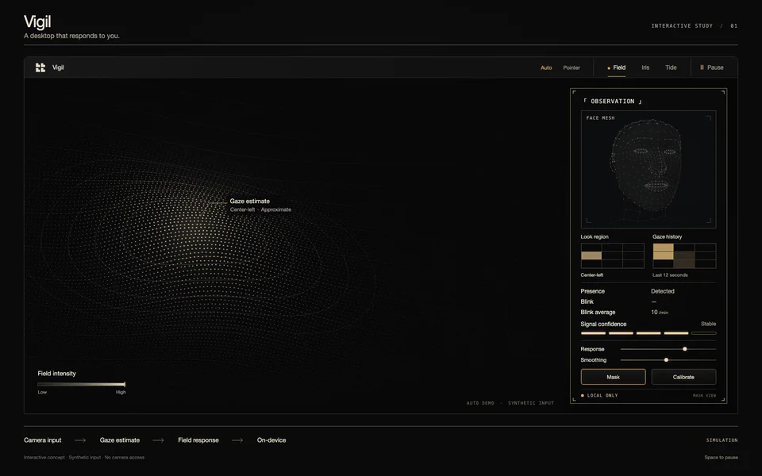

# Vigil

**A desktop that responds to you.**

*36-second recording of the interactive browser simulation. Synthetic input; no camera access or real gaze tracking. [High-quality video](vigil-demo-v4.mp4) · [Still preview](vigil-demo-v4.png) · [Visual provenance](VISUAL.md).*

Vigil is a planned macOS menu-bar app for Apple Silicon, targeting macOS 14+. It will process the built-in camera on-device to estimate presence, head pose, blinks and coarse gaze regions, driving reactive Metal desktop scenes and a floating Observation HUD.

## Status

**Native macOS app: planned. Interactive visual simulation: built and tested locally.** This repository contains documentation and preview media only. The standalone browser simulation is maintained separately; no app source, dependencies, build configuration or binaries are included here. Native product features and performance figures remain requirements, not verified capabilities. There is no native app to install yet.

## Interactive preview

The preview is recorded from real, animated point-and-line geometry. A synthetic gaze path moves the illuminated field region and the matching 3×3 HUD indicator. The forward-facing anatomical face uses connected triangles, clean facial contours and restrained landmarks. Simulated blinks close the eyelids fully. The field and automatic gaze move at one-third the initial preview speed. No photographic person or camera feed is used.

The HUD pairs the current look region with a heatmap of gaze dwell over the preceding 12 seconds. Blink average counts synthetic events over the trailing 60 seconds and displays blinks per minute. The demo starts with a seeded synthetic history; Pointer mode accumulates the actual simulated input history. These are simulation readouts.

The local simulation supports Auto and Pointer input, keyboard arrows and touch, three distinct Field / Iris / Tide scenes, Pause, Mask, Response and Smoothing, plus an explicitly simulated five-point calibration walkthrough. Reduced-motion preferences start it paused. The narrow layout stacks the Observation panel below the field.

Controls, layout, pause/resume and deterministic loop rendering were checked in Chromium. These are browser-simulation checks, not validation of camera perception, native Metal rendering, gaze accuracy or product performance. No public interactive site has been deployed.

A personal project by [Ezekiel A. Mitchell](https://github.com/ezekielamitchell). The original supplied brief is preserved verbatim in [SPECIFICATION.md](SPECIFICATION.md).

## Planned v1

| Feature | Intended behavior |
| --- | --- |
| Presence engine | AVFoundation and Vision; face rectangle, yaw/pitch/roll, pupils, eye openness and confidence. One Euro filtering; 30 Hz with a face, 5 Hz without. |
| Living desktop | Click-through desktop-level Metal windows across displays and Spaces. Field bends a dot matrix toward attention; Iris tracks head position and leaning; Tide ripples on blinks. 60 fps cap, 30 fps on battery. |
| Observation HUD | Non-activating panel, 160×120 camera inset, corner brackets, pupil crosshairs, monospace telemetry and hotkey. Mask mode shows landmarks on black without camera pixels. |
| Calibration | Optional five points in five seconds; ridge regression; three validation points select a 3×3 or 3×2 region grid. External displays receive presence-driven scenes only. |
| Controls | Pause, scene picker and signal color. Automatic pause on lock, display sleep, full-screen foreground app, Low Power Mode and battery below 20%. |
| Privacy | Camera frames in memory only; no recording, tracking export, accounts or analytics. Every pause stops camera capture. |
| Distribution | Planned free HUD and Field; Pro unlock by license key, offline after activation. Sparkle 2 updates and notarized DMG. Merchant and pricing undecided. |

## Privacy and limits

The planned app requests Camera only: no Screen Recording, Accessibility or Input Monitoring. Frames must never be saved or uploaded. Networking is limited to licensing and updates, subject to the unresolved delivery details in [DECISIONS.md](DECISIONS.md). These commitments need implementation and audit before they can be claimed as verified behavior.

Gaze is a coarse estimate, visualized as a soft lens with an error-dependent radius. No gaze-driven pointer/clicks, health or fatigue output, attention scores, multi-face tracking, remote viewing, screen recording, cloud service or cross-platform version is in scope.

## Planned stack

Swift 6; SwiftUI for MenuBarExtra, settings and onboarding; AppKit for desktop windows and HUD; AVFoundation and Vision for capture/perception; Metal via MTKView for rendering. XcodeGen generates the future Xcode project. Sparkle 2 is the only planned application dependency. Additional dependencies require an owner decision.

Development and native validation will run locally on a Mac with Xcode. Perception tests will use consented replay fixtures; live-camera checks are manual. No toolchain or dependency revision has been pinned and no compatibility checks have run.

## Visual direction

The visual direction uses graphite, warm ivory, restrained amber and clean sans-serif typography. The working simulation follows the [accepted v4 concept](vigil-concept-v4.png): a procedural human presence figure, a detailed reactive field, approximate gaze contours and a compact Observation HUD. Its face uses generic anatomical geometry, refined with a quieter connected mesh and custom cranium, ear and neck detail. [Geometry attribution](THIRD_PARTY_NOTICES.md). System fonts keep the local build self-contained. The owner-selected [Four Horses mark](four-horses-icon-black-v3.png) is the official personal-project icon, used beside Vigil and in its browser tab.

The browser scenes demonstrate the visual direction with synthetic input. Their mechanics are illustrative and do not establish the planned native app's perception pipeline or final scene algorithms. Earlier generated concepts remain in [VISUAL.md](VISUAL.md).

## Documentation

- [VISUAL.md](VISUAL.md): rendered simulation details, concept prompts and preserved version history.
- [SPECIFICATION.md](SPECIFICATION.md): complete original brief, proposed future layout, approved copy, QA commands and definition of done.
- [ROADMAP.md](ROADMAP.md): relative milestones and acceptance targets.
- [PRIVACY.md](PRIVACY.md): data boundaries, permissions and verification requirements.
- [DECISIONS.md](DECISIONS.md): scope decisions and unresolved native implementation and distribution questions.
- [AGENTS.md](AGENTS.md): documentation/media scope and future contributor guidance.

## Development status and contribution scope

The owner authorized a separate browser simulation and README exports. Keep this repository limited to documentation and selected preview media; the native application remains unstarted. The original specification's folder tree is a proposal, not existing structure. No native source folders, build files, workflows or placeholders should be added without a further request. The proposed 30-day native roadmap has no start date. No native benchmarks or release checks have run.

## License

No source license has been selected for original Vigil code. Third-party geometry used in the separate simulation retains its Apache-2.0 license, documented in [THIRD_PARTY_NOTICES.md](THIRD_PARTY_NOTICES.md). Consumer Free/Pro licensing is separate from source licensing. Third-party notices and distribution terms must be resolved before shipping.
