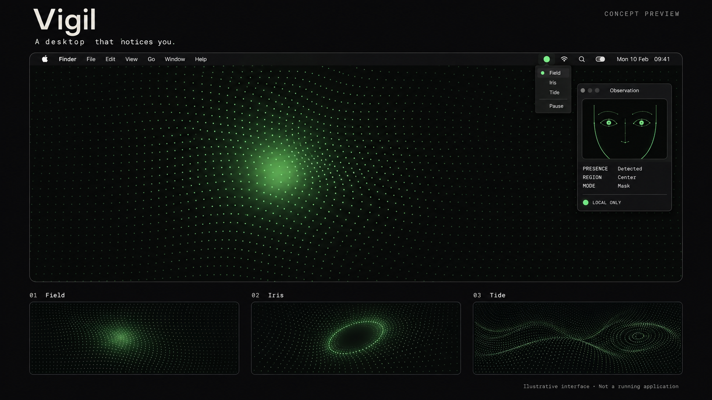

# Vigil

**A desktop that notices you.**

*Illustrative concept preview — not a running application or verified product screenshot. [Visual provenance and generation prompt](VISUAL.md).*

Vigil is a planned macOS menu-bar app for Apple Silicon, targeting macOS 14+. It will process the built-in camera on-device to estimate presence, head pose, blinks and coarse gaze regions, driving reactive Metal desktop scenes and a floating Observation HUD.

## Status

**Documentation and visual concept only. Implementation has not started in this repository.** No source directories, application code, build configuration, fixtures, dependencies or binaries are included. Features and performance figures describe requirements, not verified capabilities. There is no application to install or build yet.

Maintained by [Ezekiel A. Mitchell](https://github.com/ezekielamitchell). The original supplied brief is preserved verbatim in [SPECIFICATION.md](SPECIFICATION.md).

## Planned v1

| Feature | Intended behavior |
| --- | --- |
| Presence engine | AVFoundation and Vision; face rectangle, yaw/pitch/roll, pupils, eye openness and confidence. One Euro filtering; 30 Hz with a face, 5 Hz without. |
| Living desktop | Click-through desktop-level Metal windows across displays and Spaces. Field bends a dot matrix toward attention; Iris tracks head position and leaning; Tide ripples on blinks. 60 fps cap, 30 fps on battery. |
| Observation HUD | Non-activating panel, 160×120 camera inset, corner brackets, pupil crosshairs, monospace telemetry and hotkey. Mask mode shows landmarks on black without camera pixels. |
| Calibration | Optional five points in five seconds; ridge regression; three validation points select a 3×3 or 3×2 region grid. External displays receive presence-driven scenes only. |
| Controls | Pause, scene picker and signal color. Automatic pause on lock, display sleep, full-screen foreground app, Low Power Mode and battery below 20%. |
| Privacy | Camera frames in memory only; no recording, tracking export, accounts or analytics. Every pause stops camera capture. |
| Distribution | Planned free HUD and Field; Pro unlock by license key, offline after activation. Sparkle 2 updates and notarized DMG. Merchant and pricing undecided. |

## Privacy and limits

The planned app requests Camera only: no Screen Recording, Accessibility or Input Monitoring. Frames must never be saved or uploaded. Networking is limited to licensing and updates, subject to the unresolved delivery details in [DECISIONS.md](DECISIONS.md). These commitments need implementation and audit before they can be claimed as verified behavior.

Gaze is a coarse estimate, visualized as a soft lens with an error-dependent radius. No gaze-driven pointer/clicks, health or fatigue output, attention scores, multi-face tracking, remote viewing, screen recording, cloud service or cross-platform version is in scope.

## Planned stack

Swift 6; SwiftUI for MenuBarExtra, settings and onboarding; AppKit for desktop windows and HUD; AVFoundation and Vision for capture/perception; Metal via MTKView for rendering. XcodeGen generates the future Xcode project. Sparkle 2 is the only planned application dependency. Additional dependencies require an owner decision.

Development and native validation will run locally on a Mac with Xcode. Perception tests will use consented replay fixtures; live-camera checks are manual. No toolchain or dependency revision has been pinned and no compatibility checks have run.

## Visual direction

Background `#0B0B0C`, text `#E8E4DA`, with phosphor `#7CFF6B` or infrared `#FF3B30` signal color. JetBrains Mono or IBM Plex Mono for telemetry, system font elsewhere. Motion follows signals; only idle breathing uses a timer. Fonts and their notices are future work.

## Documentation

- [SPECIFICATION.md](SPECIFICATION.md): complete original brief, proposed future layout, approved copy, QA commands and definition of done.
- [ROADMAP.md](ROADMAP.md): relative milestones and acceptance targets.
- [PRIVACY.md](PRIVACY.md): data boundaries, permissions and verification requirements.
- [DECISIONS.md](DECISIONS.md): unresolved implementation and distribution decisions.
- [AGENTS.md](AGENTS.md): documentation-only scope and future contributor guidance.

## Development status and contribution scope

Current changes are limited to documentation and the owner-requested README concept image. Implementation requires a separate request. The specification's folder tree is a proposal, not existing structure. Do not add placeholder directories, build files, workflows or code during this setup. The proposed 30-day roadmap has no start date and is not evidence of progress. No tests, benchmarks or release checks have run.

## License

No open-source license has been selected or granted. Consumer Free/Pro licensing is separate from source licensing. Third-party notices and distribution terms must be resolved before shipping.
